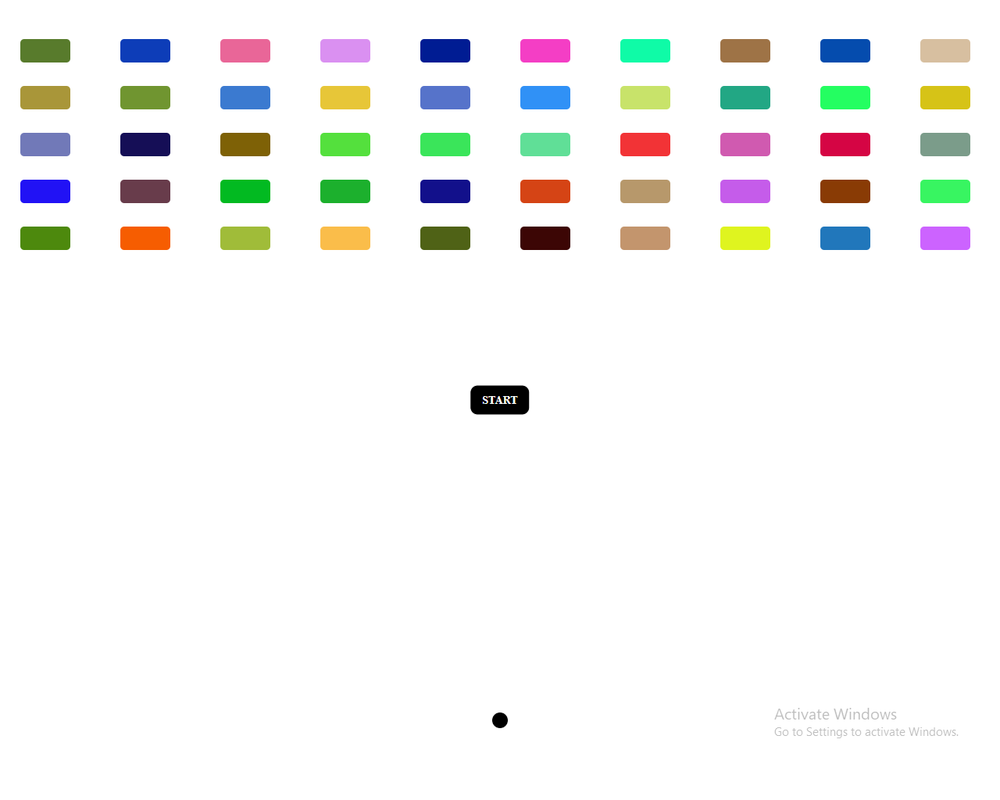

# Color Blast

Welcome to Color Blast! This repository contains a simple game created using HTML, CSS, and JavaScript. 

## Mechanics

In Color Blast, the objective is simple: destroy all the blocks as quickly as possible. To start the game, simply click the "Start" button. Once the game begins, click on the blocks to destroy them. Keep an eye on the stopwatch which records how fast you're able to clear all the blocks.

## Preview

Here's a preview of the game:



## Getting Started

To get started with Color Blast, simply clone this repository to your local machine and open `index.html` in your preferred web browser.

```bash
git clone https://github.com/your-username/color-blast.git
cd color-blast
